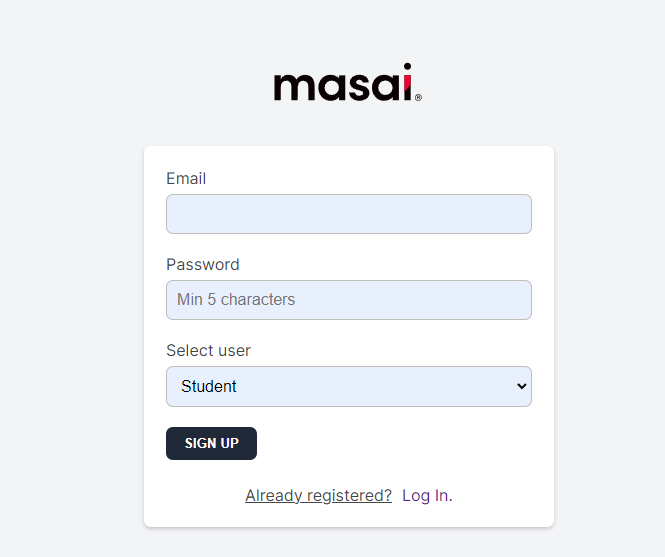
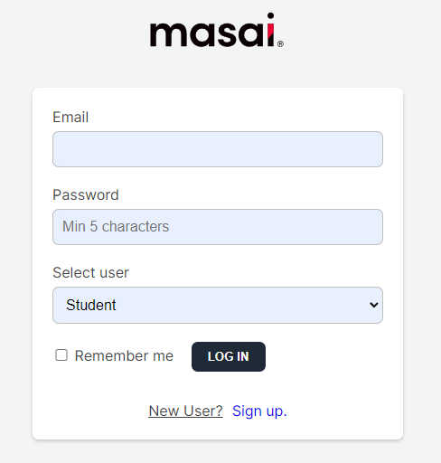
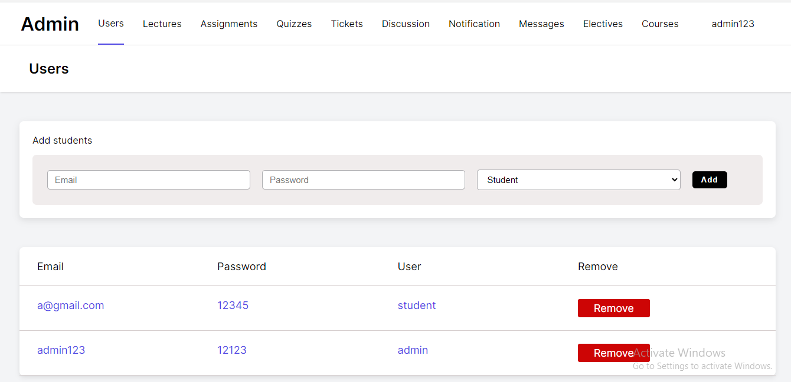
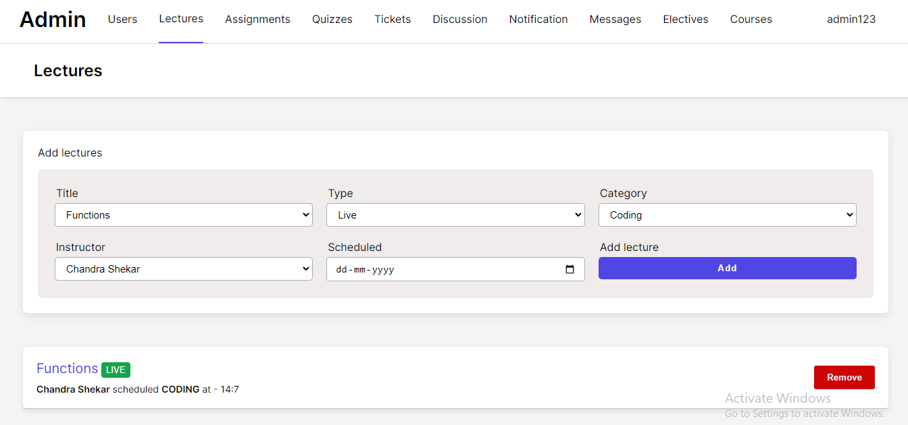
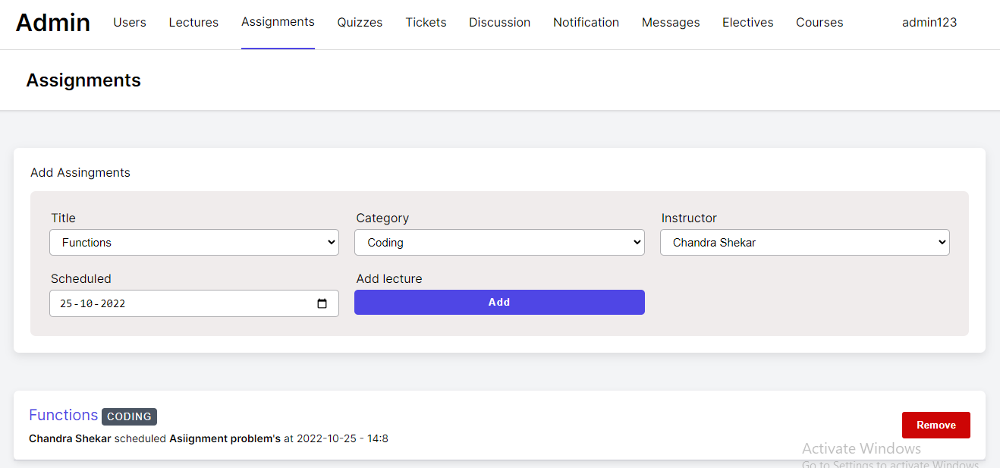
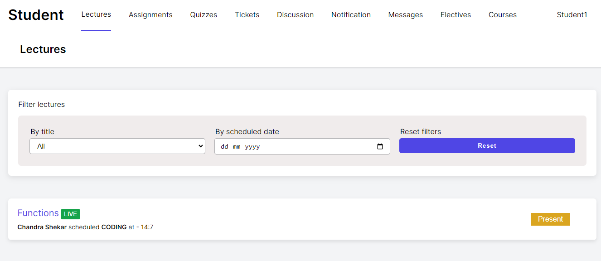
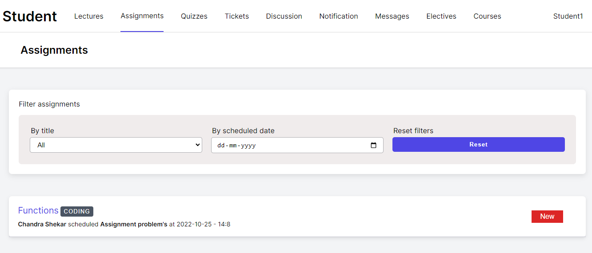

# Learning-Managment-System

### Hi there 👋, Welcome to this fantastic project.

This is one of my best project that I had built myself.

## Deployed Link :-https://learning-managment-system.netlify.app/

### There are basically two types of users . One is `Admin` and another is `Student`. 

### Features of the project

## Admin Can     -------------------------------------------------------- 

1. Add student                               
2. Remove student 
3. Add lectures 
4. Remove lectures  
5. Add Assignments 
6. Remove Assignments 

## Student Can  --------------------------------------------------------

1. Can see lectures 
2. Filter lectures
3. Can see assignments
4. Filter assignments

### Some pictures added here.

## Signup

## Login 

## Admin

## Admin Lecture Page

## Admin Assignment Page

## Student Lecture Page

## Student Assignment Page

 ## If You have Any Query Fell Free To Reach :- 
   
  ### Email : alalu75666@gmail.com
  ### LinkedIn : https://www.linkedin.com/in/alal-uddin-066444206/

  ## THANK YOU..... 🤗 🤗 🤗 🤗 🤗 

